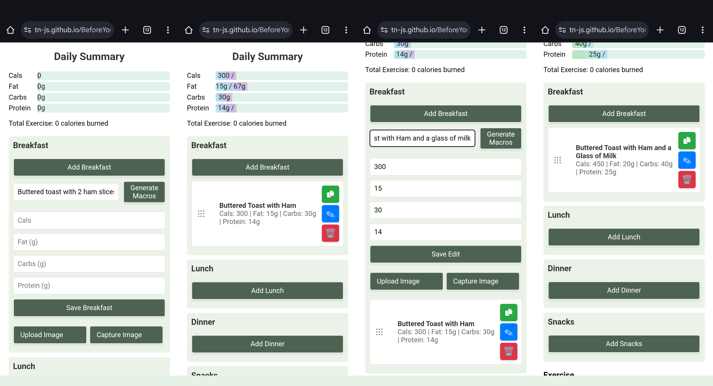

# Before You Eat

**Before You Eat** is a mobile-friendly web application that streamlines the process of logging and estimating nutritional content for your meals. With just a couple of taps, you can upload an image of your food—or type its name—and instantly receive approximate calorie, protein, carb, and fat values. Designed for simplicity, the app stores all data locally, making it effortlessly accessible without any account setup.

## Key Features

- **Instant Nutritional Estimates**: Upload or snap a photo of your meal, and the app automatically generates estimated macros (calories, fat, carbs, and protein) using OpenAI’s GPT-4o-mini model.

- **Text-Based Meal Input**: Don’t have a photo? Simply type in a dish name and hit "Generate Macros." The app interprets your input - even if misspelled - and provides an estimated macro profile.

- **Daily Goals Tracking**: Set custom macro goals for each day. The app visualizes your progress with intuitive bars, making it easy to see how close you are to meeting your targets.

- **Flexible Meal Organization**: Easily categorize meals under breakfast, lunch, dinner, snacks, or even log exercises. Drag-and-drop entries between these categories for better organization.

- **Local Data Storage**: All logs are saved in your browser’s local storage, providing instant access without any login. The storage system automatically removes older entries when space (approximately 5 MB) runs low, ensuring uninterrupted logging.

## How It Works

1. **Capture or Upload an Image**:
    Tap “Upload” or “Capture” and select your meal photo.

2. **Nutritional Analysis**:
    The photo is sent to the GPT-4o-mini model with a custom prompt. The model returns the estimated nutritional content in the format: `Name: [Name of dish] ,Cals: a, Protein: b [g], Carbs: c [g], Fat: d [g]`. Alternatively, type a dish name and hit “Generate Macros” or manually input values and save.

3. **Quick Logging**:
    The extracted nutritional values are automatically added to your daily log.

## Technologies and Frameworks

- **Frontend**: HTML, CSS, JavaScript
- **Backend**: Python, Flask, Render, OpenAI's gpt-4o-mini API for image and text-based meal analysis
- **Storage**: Browser local storage (no dedicated database or user accounts)

## Live Demo

https://tn-js.github.io/BeforeYouEat/

## Images

**Uploading an image**

From left to right:

1. Main page
2. Pressing the "Add Breakfast" button
3. Pressing the "Upload Image" button and choosing an image to be uploaded
4. The main page with the uploaded meal added with automatically logged macros and dish name.

**Text input and editing**

From left to right:

1. Inputing "Buttered toast with 2 ham slices" in the Add Breakfast slot
3. The Breakfast slot automatically filled in after pressing the "Generate Macros" button
3. The edit input field opened up with the dish name being changed from "Buttered Toast with Ham" to "Buttered Toast with Ham and a glass of milk" after having pressed the blue edit button on the "Buttered Toast with Ham" entry in image 2.
4. The new entry for "Buttered Toast with Ham and a Glass of Milk" with automatically revised macros

## License

This project is licensed under the MIT License.
